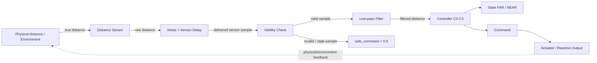
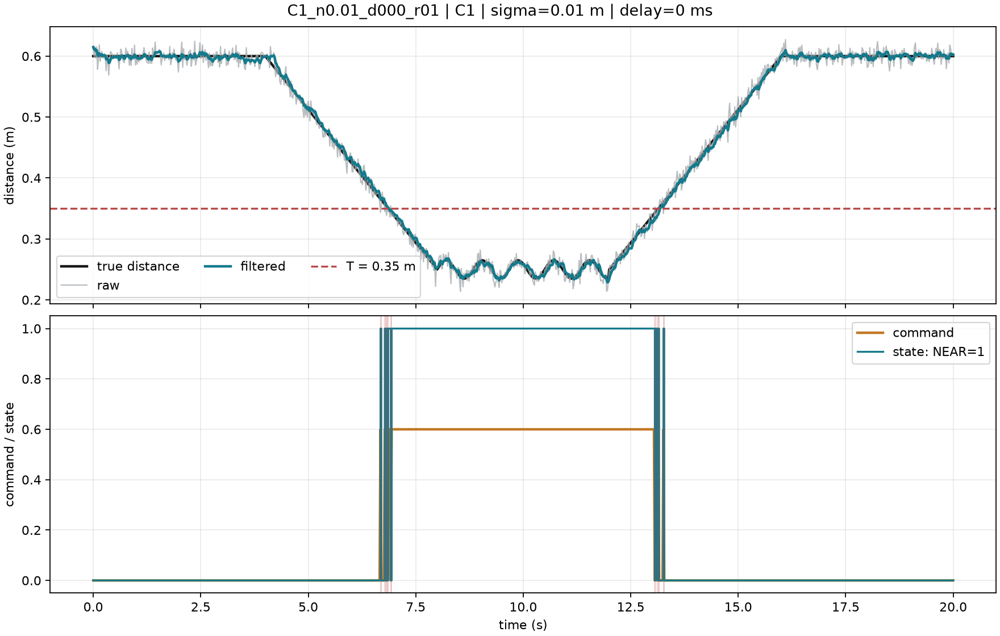
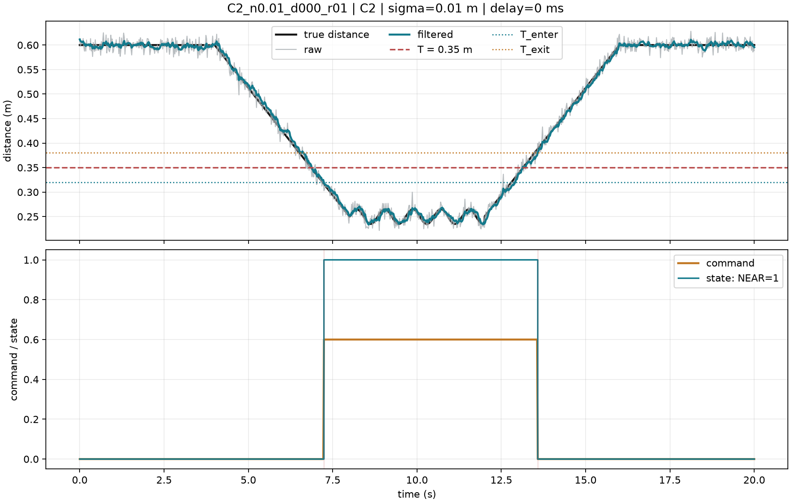

# Lab 02 — Prediction ก่อนทดลอง

สมาชิก: นาย ปีเตอร์ ประสิทธิพร 6752500070  
วันที่: 28/9/2569

## Prediction

1. เมื่อ noise เพิ่มขึ้น C1 จะมี switching count เปลี่ยนอย่างไร?  
คำตอบ: คาดว่า switching count จะเพิ่มขึ้น เพราะ C1 ใช้ single threshold เพียงค่าเดียวที่ 0.35 m ดังนั้นเมื่อ sensor มี noise ค่าที่วัดอาจแกว่งข้าม threshold ไปมา ทำให้ state สลับ FAR และ NEAR หลายครั้งมากขึ้น

2. C2 จะลด false trigger โดยแลกกับ latency หรือ recovery time อย่างไร?  
คำตอบ: คาดว่า C2 จะลด false trigger ได้ เพราะใช้ low-pass filter และ hysteresis ช่วยลดผลของ noise และลดการสลับ state ที่เกิดจากค่าที่แกว่งใกล้ threshold แต่ผลแลกเปลี่ยนคือ response latency หรือ recovery time อาจเพิ่มขึ้น เนื่องจาก filter ทำให้สัญญาณตอบสนองช้ากว่า raw sensor และ hysteresis ต้องรอให้ค่าข้ามเกณฑ์ที่กำหนดก่อนจึงเปลี่ยน state

3. เมื่อเพิ่ม sensor delay เส้น command จะเลื่อนจาก physical event เท่าใด?  
คำตอบ: คาดว่าเส้น command จะเลื่อนไปด้านหลัง physical event ใกล้เคียงกับ sensor delay ที่เพิ่มเข้าไป เช่น ถ้าเพิ่ม delay 300 ms การตอบสนองของ controller ก็น่าจะช้าลงประมาณ 300 ms แต่ค่าจริงอาจมากกว่านี้เล็กน้อยจาก filter และ logic ของ controller

## ผลการวิเคราะห์

### 1. เปรียบเทียบ C1 และ C2

จากผลการทดลอง C1 มี enter latency ประมาณ 0.0189 s และ exit latency ประมาณ 0.0291 s แต่มี extra switches เฉลี่ย 12.4 ครั้ง และ false trigger rate ประมาณ 8.39 ครั้ง/นาที

ส่วน C2 มี enter latency ประมาณ 0.4069 s และ exit latency ประมาณ 0.4531 s แต่มี extra switches = 0 และ false trigger rate = 0

ดังนั้น C2 สามารถลดการสลับสถานะที่เกิดจาก noise และลด false trigger ได้อย่างชัดเจน แต่ต้องแลกกับ response latency ที่สูงกว่า C1 เนื่องจาก C2 ใช้ low-pass filter และ hysteresis ก่อนที่จะเปลี่ยนสถานะ FAR/NEAR

### 2. ผลของ Sensor Delay

จากการทดลอง C2 ที่ noise = 0.0 m พบว่าเมื่อเพิ่ม sensor delay response latency เพิ่มขึ้นตามค่าที่หน่วงไว้

- delay 0 ms: enter latency ≈ 0.4229 s, exit latency ≈ 0.4171 s
- delay 100 ms: enter latency ≈ 0.5229 s, exit latency ≈ 0.5171 s
- delay 300 ms: enter latency ≈ 0.7229 s, exit latency ≈ 0.7171 s

ดังนั้น sensor delay ทำให้การตอบสนองของ controller ช้าลงเกือบตรงตาม delay ที่เพิ่มเข้าไป โดยพื้นฐาน C2 มี latency จาก low-pass filter และ hysteresis อยู่แล้วประมาณ 0.42 s และเมื่อเพิ่ม delay 300 ms latency รวมจึงเพิ่มเป็นประมาณ 0.72 s

### 3. ผลของ Sensor Noise

จากการทดลอง C2 ที่ delay = 0 ms พบว่าเมื่อเพิ่ม noise จาก 0.00 m เป็น 0.01 m และ 0.03 m ค่า latency ไม่ได้เพิ่มขึ้นแบบเป็นเส้นตรง

- noise 0.00 m: enter latency ≈ 0.4229 s, exit latency ≈ 0.4171 s
- noise 0.01 m: enter latency ≈ 0.4309 s, exit latency ≈ 0.4171 s
- noise 0.03 m: enter latency ≈ 0.4069 s, exit latency ≈ 0.3531 s

อย่างไรก็ตาม false trigger rate ยังคงเป็น 0 ในทุกระดับ noise ที่ทดสอบ แสดงว่า low-pass filter และ hysteresis ของ C2 ช่วยลดผลของ sensor noise และป้องกันการเปลี่ยนสถานะผิดพลาดใกล้ threshold ได้ดีในชุดการทดลองนี้

### 4. เมื่อ noise เพิ่มจาก 0.01 เป็น 0.03 m ค่าใดเปลี่ยนชัดที่สุด

เมื่อเพิ่ม noise จาก 0.01 m เป็น 0.03 m ที่ delay = 0 ms พบว่า ค่า `latency_exit_s_mean` เปลี่ยนชัดที่สุด โดยลดจากประมาณ 0.4171 s เหลือ 0.3531 s หรือเปลี่ยนประมาณ 0.064 s

ส่วน `latency_enter_s_mean` ลดจากประมาณ 0.4309 s เป็น 0.4069 s และ `recovery_time_s_mean` ลดจากประมาณ 0.4337 s เป็น 0.4097 s

ขณะที่ `false_trigger_rate = 0`, `extra_switches = 0` และ `mean_abs_command_change_mean = 0.0012` ยังคงเท่าเดิม

ดังนั้นในชุดทดลองนี้ noise ที่เพิ่มขึ้นไม่ได้ทำให้ทุก metric แย่ลงแบบเป็นเส้นตรง และ C2 ยังคงป้องกัน false trigger และ extra switching ได้ในระดับ noise ที่ทดสอบ

### 5. ผลของ Sensor Delay 300 ms

เมื่อเพิ่ม sensor delay จาก 0 ms เป็น 300 ms ค่า enter latency เพิ่มจากประมาณ 0.4229 s เป็น 0.7229 s หรือเพิ่มขึ้นประมาณ 0.3000 s

ดังนั้น delay 300 ms ทำให้ response latency เพิ่มขึ้นใกล้เคียง 300 ms จริง เพราะข้อมูลจาก sensor ถูกส่งไปยัง controller ช้าลงตามเวลาที่หน่วงไว้ ส่วน latency เดิมประมาณ 0.42 s มาจากพฤติกรรมของ C2 ที่มี low-pass filter และ hysteresis อยู่แล้ว

### 6. C3, Command Limit และ Smoothness

จากการตรวจ C3 ทั้ง 5 trials พบว่าค่า absolute command สูงสุดอยู่ประมาณ 0.5187–0.5324 โดยค่าสูงสุดประมาณ 0.5324 ใน trial r03 ซึ่งยังต่ำกว่า command limit ±0.6

ดังนั้น C3 ไม่ได้ชน command limit ในชุดการทดลองนี้

เมื่อพิจารณา smoothness พบว่า `MeanAbsCommandChange` อยู่ประมาณ 0.00455–0.00470 ซึ่งเป็นค่าค่อนข้างต่ำและใกล้เคียงกันในทุก trial แสดงว่า command เปลี่ยนอย่างค่อนข้างต่อเนื่อง

ขณะเดียวกัน `MeanAbsTrackingError` อยู่ประมาณ 0.161–0.162 m ดังนั้นการที่ command มีความ smooth ไม่ได้หมายความว่า tracking error จะต้องมีค่าน้อยเสมอไป ทั้งสอง metric ต้องพิจารณาแยกกัน

### 7. Invalid Sample และ Safe Command

จากผลการทดลอง controller comparison พบว่า C0, C1, C2 และ C3 มีค่า `invalid_sample_count_mean = 0` ทั้งหมด

ดังนั้นในการทดลองชุดนี้ไม่พบ invalid sample เกิดขึ้นจริง

อย่างไรก็ตาม student controller กำหนด `safe_command = 0.0` สำหรับกรณีที่ sensor sample เป็น invalid หรือ stale เพื่อป้องกันไม่ให้ controller ส่ง command จากข้อมูลที่ไม่สามารถเชื่อถือได้

การทำงานส่วนนี้ได้รับการตรวจจาก `grade_submission.py` แล้ว โดยหัวข้อ `invalid_sample` ผ่านการทดสอบ (PASS)

## Block Diagram ของ Sensorimotor Loop

โครงสร้างนี้แสดงลำดับข้อมูลโดยรวมจากระยะจริง ผ่าน distance sensor, noise และ sensor delay จากนั้นตรวจสอบ validity ของข้อมูล ก่อนผ่าน low-pass filter และ controller เพื่อสร้าง state และ command

ในกรณีที่ sensor sample เป็น invalid หรือ stale ระบบจะใช้ `safe_command = 0.0` แทนการนำข้อมูลที่ไม่สามารถเชื่อถือได้ไปสร้าง command

หมายเหตุ: ใน simulator ของ Lab 02 ค่า `true_distance_m` เป็น trajectory ที่กำหนดไว้ล่วงหน้า ดังนั้น command ไม่ได้ย้อนกลับไปเปลี่ยนระยะจริงโดยตรง ลูกศร feedback ใน block diagram จึงเป็นการแสดง sensorimotor loop เชิงแนวคิดสำหรับระบบจริง

## กราฟตัวแทน C1 และ C2

### C1 — Single Threshold

Physical crossing:
- ENTER ≈ 6.857 s
- EXIT ≈ 13.143 s

First correct response:
- ENTER ≈ 6.860 s
- EXIT ≈ 13.160 s

Latency:
- ENTER ≈ 0.0029 s
- EXIT ≈ 0.0171 s

C1 ตอบสนองได้รวดเร็ว แต่มีการสลับสถานะหลายครั้งบริเวณ threshold
เนื่องจาก sensor noise ทำให้ค่าที่วัดแกว่งข้าม threshold ไปมา

### C2 — Low-pass Filter + Hysteresis

Physical crossing:
- ENTER ≈ 6.857 s
- EXIT ≈ 13.143 s

First correct response:
- ENTER ≈ 7.240 s
- EXIT ≈ 13.580 s

Latency:
- ENTER ≈ 0.3829 s
- EXIT ≈ 0.4371 s

C2 ไม่มี extra switching ใน trial นี้ เพราะ low-pass filter และ hysteresis
ช่วยลดผลของ noise แต่ต้องแลกกับ latency ที่สูงกว่า C1