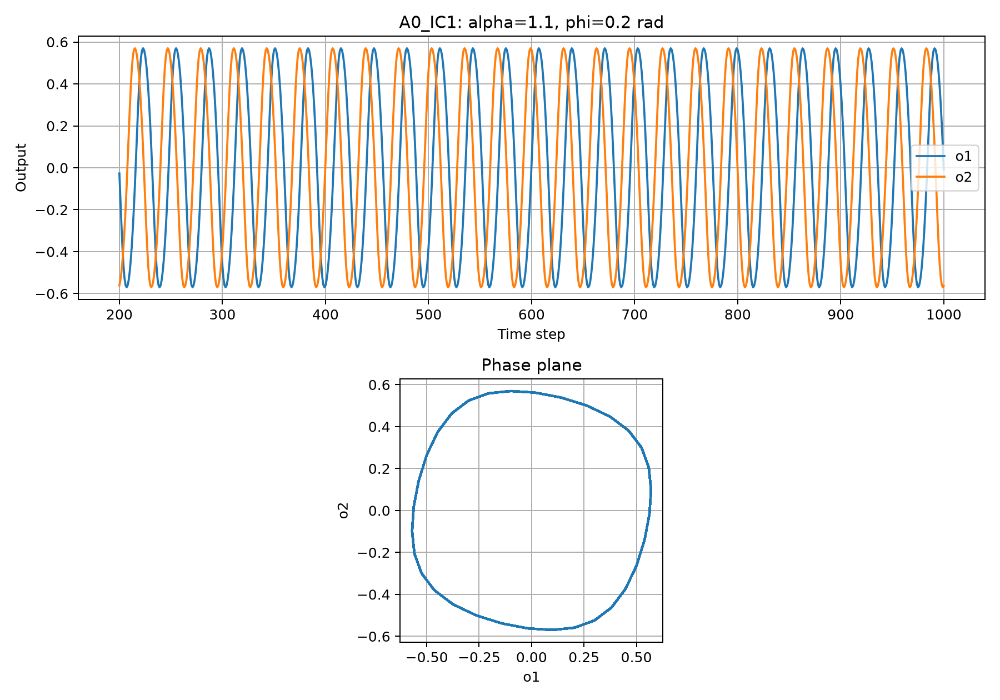
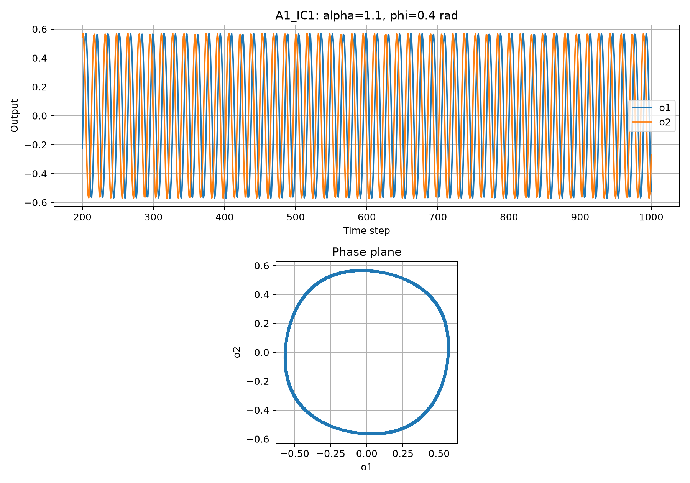
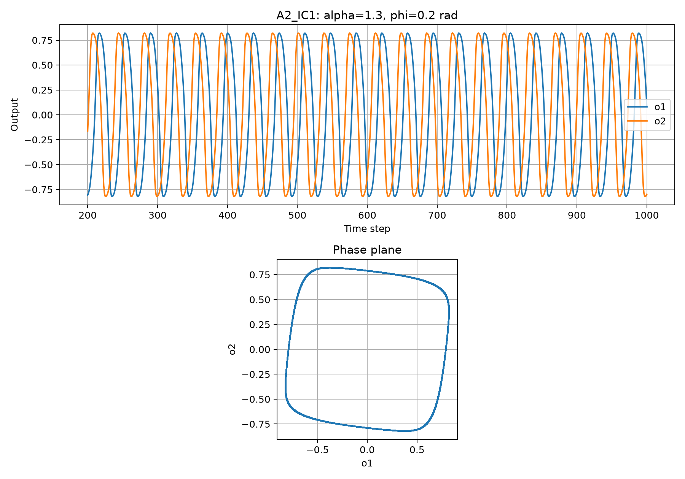

# Lab A — SO(2) Central Pattern Generator

Lab A เป็นการทดลองพฤติกรรมของวงจร SO(2) Central Pattern Generator (CPG) แบบสองนิวรอน โดยศึกษาผลของพารามิเตอร์ `alpha (α)` และ `phi (φ)` ต่อรูปคลื่นของ output `o1` และ `o2` รวมถึงวัดค่า amplitude, period และ phase lag ของ oscillator

---

## 1. Objective

วัตถุประสงค์ของการทดลอง

- ศึกษาการทำงานของ SO(2) CPG แบบสองนิวรอน
- เปรียบเทียบผลของการเปลี่ยน `φ` โดยคงค่า `α`
- เปรียบเทียบผลของการเปลี่ยน `α` โดยคงค่า `φ`
- วัด amplitude, period และ phase lag จาก output ของ CPG
- ตรวจสอบผลจาก initial condition ที่แตกต่างกัน
- สร้าง Time Plot และ Phase-plane Plot สำหรับวิเคราะห์พฤติกรรมของ oscillator

---

## 2. SO(2) CPG Model

เมทริกซ์น้ำหนักของ SO(2) CPG คือ

```text
W(α,φ) = α [ cos(φ)     sin(φ) ]
           [-sin(φ)     cos(φ) ]
```

ดังนั้นค่าน้ำหนักของระบบคือ

```text
w11 = α cos(φ)
w12 = α sin(φ)
w21 = -α sin(φ)
w22 = α cos(φ)
```

สมการ activation คือ

```text
a1(t+1) = w11 o1(t) + w12 o2(t)

a2(t+1) = w21 o1(t) + w22 o2(t)
```

และ output ของแต่ละ neuron คำนวณด้วยฟังก์ชัน `tanh`

```text
o1(t) = tanh(a1(t))
o2(t) = tanh(a2(t))
```

การคำนวณ `a1(t+1)` และ `a2(t+1)` ต้องใช้ค่า output จากเวลา `t` ชุดเดียวกัน หรือเป็นการคำนวณแบบ simultaneous update

---

## 3. Experimental Conditions

การทดลองแบ่งเป็น 3 conditions

| Condition | α | φ (rad) | Description |
|---|---:|---:|---|
| A0 | 1.1 | 0.2 | Baseline |
| A1 | 1.1 | 0.4 | Change φ only |
| A2 | 1.3 | 0.2 | Change α only |

รายละเอียดของแต่ละ condition

- **A0** ใช้เป็นค่าอ้างอิง โดยกำหนด `α = 1.1` และ `φ = 0.2 rad`
- **A1** เพิ่มเฉพาะ `φ` จาก 0.2 เป็น 0.4 rad โดยคง `α = 1.1`
- **A2** เพิ่มเฉพาะ `α` จาก 1.1 เป็น 1.3 โดยคง `φ = 0.2 rad`

การเปลี่ยนพารามิเตอร์ทีละตัวทำให้สามารถเปรียบเทียบผลของ `α` และ `φ` ได้อย่างชัดเจน

---

## 4. Initial Conditions

แต่ละ condition ใช้ initial conditions จำนวน 3 แบบ

```text
IC1 = (a1, a2) = (0.1, 0.0)

IC2 = (a1, a2) = (0.0, 0.1)

IC3 = (a1, a2) = (0.1, 0.1)
```

ดังนั้นจำนวนการทดลองทั้งหมดคือ

```text
3 conditions × 3 initial conditions = 9 runs
```

---

## 5. Simulation Settings

การทดลองกำหนดค่า simulation ดังนี้

```text
Simulation steps = 1000 steps
Warm-up / transient = 200 steps
Analysis range = step 200–1000
Activation function = tanh
```

200 steps แรกถูกตัดออกจากการวิเคราะห์ เนื่องจากถือว่าเป็นช่วง transient ของ oscillator

---

## 6. How to Run

หากยังไม่มี Matplotlib ให้ติดตั้งก่อนด้วยคำสั่ง

```powershell
py -m pip install matplotlib
```

จากโฟลเดอร์ `lab_03` รัน Lab A ด้วยคำสั่ง

```powershell
py labA\lab_a.py
```

ผลลัพธ์จะถูกบันทึกในโฟลเดอร์

```text
results\lab_a
```

---

## 7. Output Files

โปรแกรมสร้าง raw CSV จำนวน 9 ไฟล์

```text
A0_IC1.csv
A0_IC2.csv
A0_IC3.csv

A1_IC1.csv
A1_IC2.csv
A1_IC3.csv

A2_IC1.csv
A2_IC2.csv
A2_IC3.csv
```

และสร้างกราฟจำนวน 9 ไฟล์

```text
A0_IC1.png
A0_IC2.png
A0_IC3.png

A1_IC1.png
A1_IC2.png
A1_IC3.png

A2_IC1.png
A2_IC2.png
A2_IC3.png
```

รวมถึงไฟล์สรุปผล

```text
lab_a_summary.csv
```

ข้อมูลที่บันทึกใน raw CSV ประกอบด้วย

```text
t
condition
a1
a2
o1
o2
alpha
phi
w11
w12
w21
w22
```

---

## 8. Measurement Method

ค่าที่ใช้วิเคราะห์วัดหลังจากตัด transient 200 steps แรกออกแล้ว

### Amplitude

คำนวณจาก

```text
Amplitude = (max - min) / 2
```

### Period

คำนวณจากจำนวน time steps ระหว่าง peak ที่ต่อเนื่องกันของสัญญาณ

### Phase lag

วัดจากความแตกต่างของตำแหน่ง peak ระหว่าง `o1` และ `o2`

ค่าที่เป็นลบหมายถึง peak ของ `o2` เกิดก่อน peak ของ `o1` ตาม convention ที่ใช้ในโปรแกรมนี้

---

## 9. Measured Results

ผลที่ได้จากการทดลองจริง

| Condition | α | φ (rad) | Amplitude o1 | Period (steps) | Phase lag (steps) |
|---|---:|---:|---:|---:|---:|
| A0 | 1.1 | 0.2 | ≈ 0.5698 | 32.00 | -8.00 |
| A1 | 1.1 | 0.4 | ≈ 0.5704 | 15.76 | ≈ -3.95 |
| A2 | 1.3 | 0.2 | ≈ 0.8212 | ≈ 36.74 | ≈ -9.21 |

ผลจาก initial conditions ทั้ง 3 แบบของแต่ละ condition ให้ค่า amplitude และ period ใกล้เคียงกันมากหลังจากผ่านช่วง transient

---

## 10. A0 — Baseline

Condition A0 กำหนด

```text
α = 1.1
φ = 0.2 rad
```

ผลที่วัดได้

```text
Amplitude o1 ≈ 0.5698
Period ≈ 32.00 steps
Phase lag ≈ -8.00 steps
```

จาก Time Plot พบว่า `o1` และ `o2` เกิด oscillation ต่อเนื่อง และมี phase difference ระหว่างกัน

หลังจากผ่านช่วง transient รูปคลื่นมี amplitude และ period ค่อนข้างคงที่

Phase-plane Plot มีลักษณะเป็นวงปิด แสดงถึง periodic oscillation ของ SO(2) CPG



---

## 11. A1 — Increasing φ

Condition A1 กำหนด

```text
α = 1.1
φ = 0.4 rad
```

โดยเพิ่มเฉพาะ `φ` เมื่อเปรียบเทียบกับ A0

ผลที่วัดได้

```text
Amplitude o1 ≈ 0.5704
Period ≈ 15.76 steps
Phase lag ≈ -3.95 steps
```

เมื่อเพิ่ม `φ` จาก 0.2 เป็น 0.4 rad พบว่า period ลดลงจากประมาณ 32.00 steps เหลือประมาณ 15.76 steps

จาก Time Plot สามารถเห็นได้ว่าจำนวนรอบของ oscillation เพิ่มขึ้นอย่างชัดเจนเมื่อเปรียบเทียบในช่วงจำนวน steps เท่ากัน

ดังนั้นการเพิ่ม `φ` ทำให้ oscillator มีจังหวะเร็วขึ้นอย่างชัดเจน

ในขณะที่ amplitude เปลี่ยนจากประมาณ 0.5698 เป็น 0.5704 ซึ่งถือว่าเปลี่ยนแปลงเพียงเล็กน้อย

Phase-plane Plot ยังคงเป็นวงปิด แสดงว่า oscillator ยังคงสร้างสัญญาณเป็นคาบอย่างต่อเนื่อง



---

## 12. A2 — Increasing α

Condition A2 กำหนด

```text
α = 1.3
φ = 0.2 rad
```

โดยเพิ่มเฉพาะ `α` เมื่อเปรียบเทียบกับ A0

ผลที่วัดได้

```text
Amplitude o1 ≈ 0.8212
Period ≈ 36.74 steps
Phase lag ≈ -9.21 steps
```

เมื่อเพิ่ม `α` จาก 1.1 เป็น 1.3 พบว่า amplitude เพิ่มขึ้นจากประมาณ 0.5698 เป็นประมาณ 0.8212 อย่างชัดเจน

นอกจากนี้ period ยังเพิ่มจากประมาณ 32.00 steps เป็นประมาณ 36.74 steps

ดังนั้นการเพิ่ม `α` ไม่ได้ส่งผลเฉพาะต่อ amplitude เท่านั้น แต่ยังทำให้ period ของ oscillator เปลี่ยนแปลงด้วย

จาก Time Plot พบว่าขนาดของสัญญาณ `o1` และ `o2` สูงขึ้นเมื่อเปรียบเทียบกับ A0

Phase-plane Plot มีขนาดใหญ่ขึ้นและรูปทรงมีลักษณะอิ่มตัวมากขึ้น ซึ่งสัมพันธ์กับ nonlinear activation function `tanh`



---

## 13. Comparison of A0, A1 and A2

### Effect of φ

เปรียบเทียบ A0 และ A1

```text
A0 : α = 1.1, φ = 0.2
A1 : α = 1.1, φ = 0.4
```

โดยคง `α = 1.1` และเปลี่ยนเฉพาะ `φ`

ผลที่ได้คือ

```text
Period:
32.00 → 15.76 steps

Amplitude:
0.5698 → 0.5704
```

แสดงว่าการเพิ่ม `φ` มีผลเด่นต่อความเร็วของ oscillation โดยทำให้ period ลดลงมาก ในขณะที่ amplitude เปลี่ยนเพียงเล็กน้อย

---

### Effect of α

เปรียบเทียบ A0 และ A2

```text
A0 : α = 1.1, φ = 0.2
A2 : α = 1.3, φ = 0.2
```

โดยคง `φ = 0.2 rad` และเปลี่ยนเฉพาะ `α`

ผลที่ได้คือ

```text
Amplitude:
0.5698 → 0.8212

Period:
32.00 → 36.74 steps
```

แสดงว่าการเพิ่ม `α` ทำให้ amplitude ของ oscillator เพิ่มขึ้นอย่างชัดเจน และ period ก็เพิ่มขึ้นด้วย

ดังนั้น `α` ไม่ควรถูกตีความว่าเป็น amplitude โดยตรง เพราะการเปลี่ยน `α` สามารถส่งผลต่อทั้งรูปคลื่นและ period ของ oscillator ได้

---

## 14. Effect of Initial Conditions

การทดลองใช้ initial conditions จำนวน 3 แบบในแต่ละ condition

จากผลการทดลองพบว่า หลังจากตัดช่วง transient 200 steps แรกแล้ว ค่า amplitude และ period ของทั้ง 3 initial conditions ใน condition เดียวกันมีค่าใกล้เคียงกันมาก

ตัวอย่าง A0

```text
IC1 period = 32.0 steps
IC2 period = 32.0 steps
IC3 period = 32.0 steps
```

ตัวอย่าง A1

```text
IC1 period = 15.76 steps
IC2 period = 15.76 steps
IC3 period = 15.76 steps
```

สำหรับ A2

```text
IC1 period ≈ 36.76 steps
IC2 period ≈ 36.76 steps
IC3 period ≈ 36.71 steps
```

จึงพบว่าภายใต้ initial conditions ที่ทดลอง ระบบมีพฤติกรรม oscillation หลัง transient ที่ใกล้เคียงกันภายในแต่ละ condition

---

## 15. Summary

จากการทดลอง Lab A สามารถสรุปได้ว่า พารามิเตอร์ `α` และ `φ` มีผลต่อพฤติกรรมของ SO(2) CPG แตกต่างกัน

การเพิ่ม `φ` จาก 0.2 เป็น 0.4 rad โดยคง `α = 1.1` ทำให้ period ลดลงจากประมาณ 32.00 steps เหลือประมาณ 15.76 steps ในขณะที่ amplitude แทบไม่เปลี่ยน แสดงว่า `φ` มีผลเด่นต่อความเร็วของจังหวะ CPG

การเพิ่ม `α` จาก 1.1 เป็น 1.3 โดยคง `φ = 0.2 rad` ทำให้ amplitude เพิ่มจากประมาณ 0.5698 เป็น 0.8212 และ period เพิ่มขึ้นเป็นประมาณ 36.74 steps แสดงว่า `α` ส่งผลต่อทั้งขนาดของ oscillation และ period

Phase-plane Plot ของทั้งสาม conditions มีลักษณะเป็นวงปิด แสดงถึง periodic oscillation หลังจากผ่านช่วง transient

ผลจาก initial conditions ทั้ง 3 แบบภายในแต่ละ condition ให้ค่าที่ใกล้เคียงกันหลัง transient

อย่างไรก็ตาม ผลการทดลองนี้เป็นผลจาก simulation ของ SO(2) CPG เท่านั้น จึงยังไม่สามารถใช้ยืนยัน dynamic stability, contact force, motor torque, energy consumption หรือความสามารถในการเดินของหุ่นยนต์จริงได้