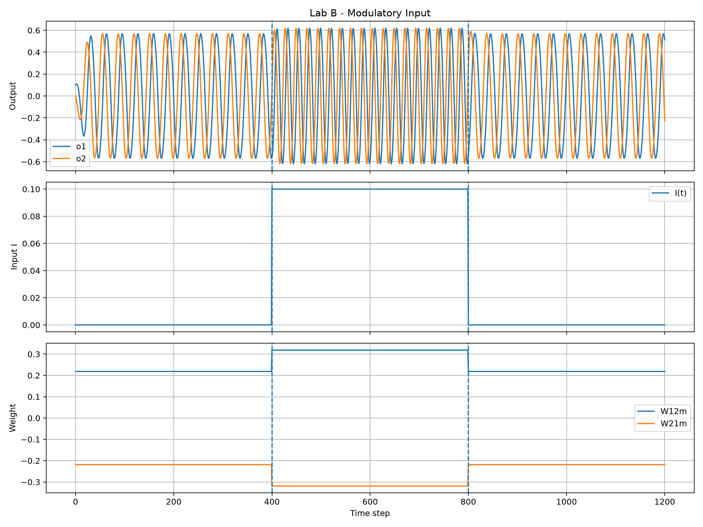

# Lab B — Modulatory Input for SO(2) CPG

Lab B ศึกษาผลของ modulatory input ต่อ SO(2) Central Pattern Generator (CPG)
โดยเปลี่ยน cross-connection ของวงจรในรูปแบบก่อน–ระหว่าง–หลังการป้อน input

---

## 1. Objective

วัตถุประสงค์ของการทดลอง

- ศึกษาผลของ modulatory input ต่อ SO(2) CPG
- ตรวจสอบการเปลี่ยนแปลงของ `W12m` และ `W21m`
- เปรียบเทียบ amplitude และ period ก่อน ระหว่าง และหลัง input
- ตรวจสอบว่าระบบสามารถกลับเข้าใกล้ baseline หลังปิด input ได้หรือไม่

---

## 2. Modulatory Input Model

สมการที่ใช้คือ

```text
W11 = W22 = Wd0

W12m = Wd1 + M I

W21m = -(Wd1 + M I)
```

โดย

```text
Wd0 = α cos(φ)
Wd1 = α sin(φ)
```

ค่าพื้นฐานที่ใช้ในการทดลอง

```text
α = 1.1
φ = 0.2 rad
M = 1.0
```

ค่า input ที่ใช้คือ

```text
I(t) = 0.0  ก่อนเปิด input
I(t) = 0.1  ระหว่างเปิด input
I(t) = 0.0  หลังปิด input
```

---

## 3. Experimental Protocol

การทดลองแบ่งออกเป็น 3 ช่วง

| Segment | Time step | I |
|---|---:|---:|
| Before | 0–399 | 0.0 |
| During | 400–799 | 0.1 |
| After | 800–1200 | 0.0 |

แต่ละช่วงถูกวิเคราะห์หลังตัด transient ช่วงต้นออก

---

## 4. How to Run

จากโฟลเดอร์ `lab_03`

```powershell
py labB\lab_b.py
```

ผลลัพธ์จะถูกบันทึกไว้ที่

```text
results\lab_b
```

---

## 5. Output Files

ไฟล์ที่สร้างจากการทดลอง

```text
lab_b.csv
lab_b_summary.csv
lab_b_plot.png
```

`lab_b.csv` เป็น raw data ของทุก time step

`lab_b_summary.csv` เป็นผลสรุปช่วง before, during และ after

`lab_b_plot.png` แสดง

- output `o1` และ `o2`
- modulatory input `I(t)`
- cross-connections `W12m` และ `W21m`

---

## 6. Measured Results

| Segment | I | W12m | W21m | Amplitude o1 | Period o1 |
|---|---:|---:|---:|---:|---:|
| Before | 0.000 | 0.2185 | -0.2185 | 0.5698 | 32.00 steps |
| During | 0.100 | 0.3185 | -0.3185 | 0.6205 | 22.17 steps |
| After | 0.000 | 0.2185 | -0.2185 | 0.5690 | 32.00 steps |

---

## 7. Result Plot



---

## 8. Analysis

ในช่วง Before ค่า input เท่ากับ `0.0`
ทำให้ cross-connection มีค่า

```text
W12m = 0.2185
W21m = -0.2185
```

และวัด period ได้ประมาณ `32.00 steps`
โดย amplitude ของ `o1` มีค่าประมาณ `0.5698`

เมื่อเข้าสู่ช่วง During และเปิด modulatory input เป็น

```text
I = 0.1
```

ค่า cross-connection เปลี่ยนเป็น

```text
W12m = 0.3185
W21m = -0.3185
```

จากผลการทดลองพบว่า amplitude เพิ่มจากประมาณ `0.5698`
เป็น `0.6205`

ขณะที่ period ลดจากประมาณ `32.00 steps`
เหลือประมาณ `22.17 steps`

ดังนั้น modulatory input ทำให้ oscillator มีจังหวะเร็วขึ้น
และ amplitude เพิ่มขึ้นในเงื่อนไขที่ทดลอง

เมื่อปิด input ในช่วง After โดยให้ `I` กลับเป็น `0.0`
ค่า `W12m` และ `W21m` กลับสู่ค่าเดิม

period กลับเป็นประมาณ `32.00 steps`
และ amplitude กลับมาใกล้ baseline ที่ประมาณ `0.5690`

---

## 9. Conclusion

ผลการทดลอง Lab B แสดงให้เห็นว่า modulatory input สามารถปรับ
cross-connection ของ SO(2) CPG ได้

เมื่อเพิ่ม input จาก `0.0` เป็น `0.1`
ขนาดของ `W12m` และ `W21m` เพิ่มขึ้น
ทำให้ period ของ oscillator ลดลงจากประมาณ `32.00`
เหลือประมาณ `22.17 steps`

ขณะเดียวกัน amplitude เพิ่มจากประมาณ `0.5698`
เป็นประมาณ `0.6205`

เมื่อ input กลับเป็น `0.0`
ค่า period และ amplitude กลับเข้าใกล้ baseline อีกครั้ง

ผลนี้เป็นผลจาก simulation ของ SO(2) CPG
และไม่ได้เป็นหลักฐานโดยตรงของ dynamic stability
หรือการทำงานของหุ่นยนต์จริง