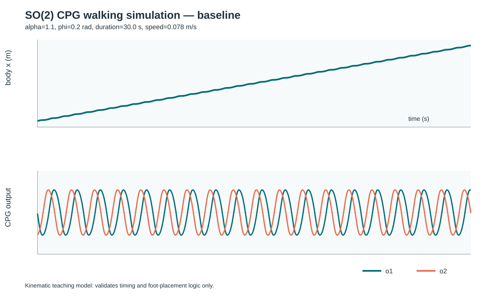
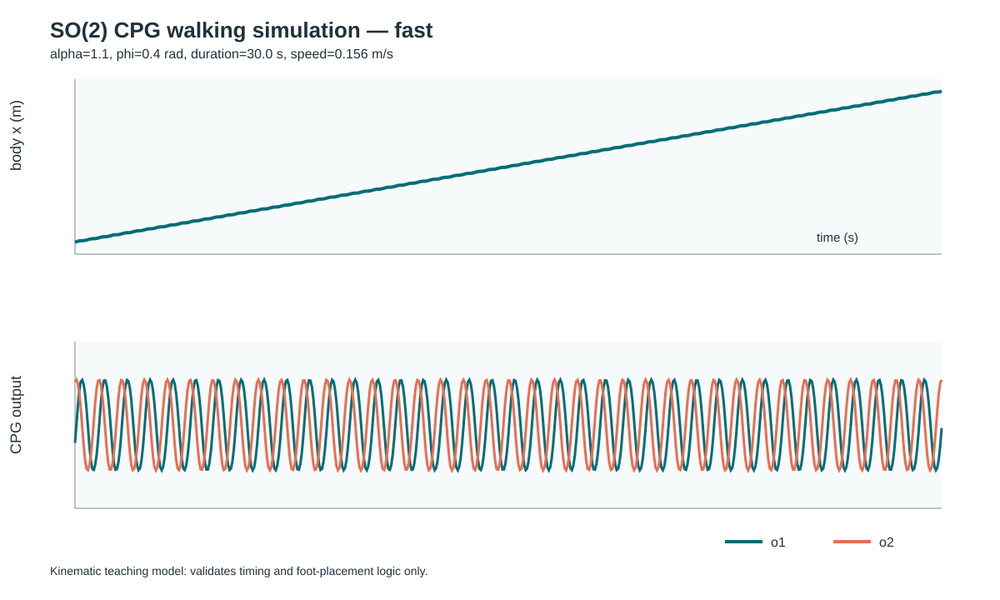
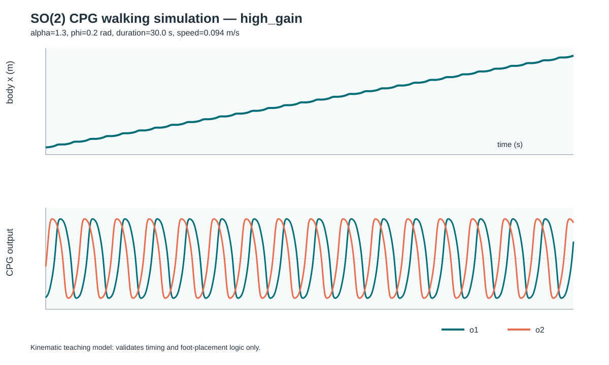

# Lab C — SO(2) CPG to Alternating Tripod Gait

Lab C เป็นการนำ output จาก SO(2) Central Pattern Generator (CPG)
ไปใช้สร้างการเดินแบบ Alternating Tripod Gait สำหรับหุ่นยนต์หกขา
และเปรียบเทียบผลของพารามิเตอร์ `α` และ `φ`
ต่อความเร็ว ความถี่ การรองรับ และความสูงในการยกเท้า

---

## 1. Objective

วัตถุประสงค์ของการทดลอง

- นำ SO(2) CPG ไปสร้างจังหวะการเดินของหุ่นยนต์หกขา
- สร้าง Alternating Tripod Gait
- เปรียบเทียบผลของการเพิ่ม `φ`
- เปรียบเทียบผลของการเพิ่ม `α`
- วัด speed, frequency, duty factor, support legs และ foot clearance
- ตรวจสอบว่ามีขารองรับอย่างน้อย 3 ขา

---

## 2. Alternating Tripod Gait

ขาของหุ่นยนต์ถูกแบ่งออกเป็น 2 กลุ่ม

### Tripod A

```text
LF
RM
LH
```

ใช้ phase sign

```text
+1
```

### Tripod B

```text
RF
LM
RH
```

ใช้ phase sign

```text
-1
```

ดังนั้นขาทั้งสองกลุ่มจะทำงานตรงข้ามเฟสกัน

เมื่อ Tripod A อยู่ในช่วง swing
Tripod B จะอยู่ในช่วง stance

และเมื่อ Tripod B อยู่ในช่วง swing
Tripod A จะอยู่ในช่วง stance

เป้าหมายคือให้มีขารองรับตัวหุ่นยนต์อย่างน้อย 3 ขา

---

## 3. Experimental Conditions

การทดลองแบ่งเป็น 3 conditions

| Condition | α | φ (rad) | Description |
|---|---:|---:|---|
| baseline | 1.10 | 0.20 | Reference condition |
| fast | 1.10 | 0.40 | Increase φ only |
| high_gain | 1.30 | 0.20 | Increase α only |

โดย

- `baseline` ใช้เป็นค่ามาตรฐาน
- `fast` เพิ่มเฉพาะค่า `φ`
- `high_gain` เพิ่มเฉพาะค่า `α`

---

## 4. Simulation Settings

ค่าที่ใช้ในการทดลอง

```text
dt = 0.05 s
duration = 30 s
warmup = 10 s
```

stride และ lift ถูกกำหนดให้เท่ากันในทุก condition
เพื่อให้เป็น controlled experiment

---

## 5. How to Run

จากโฟลเดอร์ `lab_03`

```powershell
py cpg_walk_sim.py --condition all --output-dir results\gait_comparison
```

ผลลัพธ์จะถูกบันทึกไว้ที่

```text
results\gait_comparison
```

---

## 6. Output Files

ผลของแต่ละ condition ประกอบด้วย raw CSV, summary JSON และกราฟ SVG

```text
baseline.csv
baseline.svg
baseline_summary.json

fast.csv
fast.svg
fast_summary.json

high_gain.csv
high_gain.svg
high_gain_summary.json

conditions_summary.csv
```

---

## 7. Measured Results

ผลที่ได้จากการทดลองจริง

| Condition | Speed (m/s) | Frequency (Hz) | Duty factor | Min support | Clearance (mm) |
|---|---:|---:|---:|---:|---:|
| baseline | 0.077756 | 0.625000 | 0.494176 | 3 | 17.095 |
| fast | 0.155511 | 1.267123 | 0.500832 | 3 | 17.113 |
| high_gain | 0.094457 | 0.544218 | 0.494176 | 3 | 24.637 |

---

## 8. Baseline

Baseline ใช้ค่า

```text
α = 1.10
φ = 0.20 rad
```

ผลที่วัดได้

```text
Speed = 0.077756 m/s
Frequency = 0.625 Hz
Minimum support legs = 3
Foot clearance = 17.095 mm
```

Baseline ใช้เป็นค่ามาตรฐานสำหรับเปรียบเทียบกับ
Fast และ High gain



---

## 9. Fast Condition

Fast condition ใช้ค่า

```text
α = 1.10
φ = 0.40 rad
```

โดยเพิ่มเฉพาะค่า `φ`

ผลที่วัดได้

```text
Speed = 0.155511 m/s
Frequency = 1.267123 Hz
Minimum support legs = 3
Foot clearance = 17.113 mm
```

เมื่อเพิ่ม `φ` จาก 0.20 เป็น 0.40 rad
พบว่า frequency เพิ่มจาก

```text
0.625 → 1.267123 Hz
```

และ speed เพิ่มจาก

```text
0.077756 → 0.155511 m/s
```

ในขณะที่ foot clearance เปลี่ยนเพียงเล็กน้อย

ดังนั้นการเพิ่ม `φ` ส่งผลเด่นต่อความถี่ของ CPG
และความเร็วในการเดิน



---

## 10. High Gain Condition

High gain ใช้ค่า

```text
α = 1.30
φ = 0.20 rad
```

โดยเพิ่มเฉพาะค่า `α`

ผลที่วัดได้

```text
Speed = 0.094457 m/s
Frequency = 0.544218 Hz
Minimum support legs = 3
Foot clearance = 24.637 mm
```

เมื่อเพิ่ม `α` จาก 1.10 เป็น 1.30
พบว่า foot clearance เพิ่มจาก

```text
17.095 → 24.637 mm
```

อย่างชัดเจน

ขณะที่ frequency ลดจาก

```text
0.625 → 0.544218 Hz
```

ดังนั้นการเพิ่ม `α`
มีผลเด่นต่อ amplitude และความสูงในการยกเท้า
แต่ไม่ได้ทำให้ frequency เพิ่มขึ้นในทิศทางเดียวกัน



---

## 11. Support Legs

ผลการทดลองทั้ง 3 conditions มีค่า

```text
minimum_support_legs = 3
```

ดังนั้นจำนวนขารองรับไม่ต่ำกว่า 3 ขา

สาเหตุเกิดจาก Alternating Tripod Gait
ที่กำหนดให้ Tripod A และ Tripod B
มี phase sign ตรงข้ามกัน

ทำให้ในแต่ละช่วงมี tripod หนึ่งกลุ่มรองรับตัวหุ่นยนต์
ขณะที่อีกกลุ่มอยู่ในช่วง swing

---

## 12. Comparison

### Effect of φ

เปรียบเทียบ baseline กับ fast

```text
φ:
0.20 → 0.40 rad

Frequency:
0.625 → 1.267123 Hz

Speed:
0.077756 → 0.155511 m/s

Clearance:
17.095 → 17.113 mm
```

การเพิ่ม `φ` ทำให้ frequency และ speed เพิ่มขึ้นอย่างชัดเจน
ในขณะที่ clearance แทบไม่เปลี่ยน

---

### Effect of α

เปรียบเทียบ baseline กับ high_gain

```text
α:
1.10 → 1.30

Clearance:
17.095 → 24.637 mm

Frequency:
0.625 → 0.544218 Hz

Speed:
0.077756 → 0.094457 m/s
```

การเพิ่ม `α` ทำให้ clearance เพิ่มขึ้นอย่างชัดเจน
ขณะที่ frequency ลดลง

ดังนั้น clearance และ frequency
ไม่ได้เปลี่ยนไปในทิศทางเดียวกัน

---

## 13. Model Limitation

การทดลองนี้เป็น kinematic simulation

แบบจำลองสามารถตรวจสอบ

```text
timing
phase
foot placement
support legs
speed
frequency
foot clearance
```

แต่ยังไม่สามารถยืนยัน

```text
dynamic stability
ground contact force
motor torque
energy consumption
actuator tracking
friction
slipping
```

ดังนั้นการที่หุ่นยนต์สามารถเดินได้ใน simulation
ไม่ได้หมายความว่าหุ่นยนต์จริงจะสามารถเดินได้อย่างเสถียรทันที

---

## 14. Conclusion

Lab C แสดงให้เห็นว่าสามารถนำ SO(2) CPG
ไปสร้าง Alternating Tripod Gait สำหรับหุ่นยนต์หกขาได้

Tripod A และ Tripod B ทำงานตรงข้ามเฟสกัน
และทุก condition มีขารองรับอย่างน้อย 3 ขา

การเพิ่ม `φ` จาก 0.20 เป็น 0.40 rad
ทำให้ frequency และ speed เพิ่มขึ้นอย่างชัดเจน

ส่วนการเพิ่ม `α` จาก 1.10 เป็น 1.30
ทำให้ foot clearance เพิ่มขึ้น
แต่ frequency ลดลง

ผลการทดลองนี้เป็นผลจาก kinematic simulation
จึงควรแยกออกจากการพิสูจน์ dynamic stability
ของหุ่นยนต์จริง